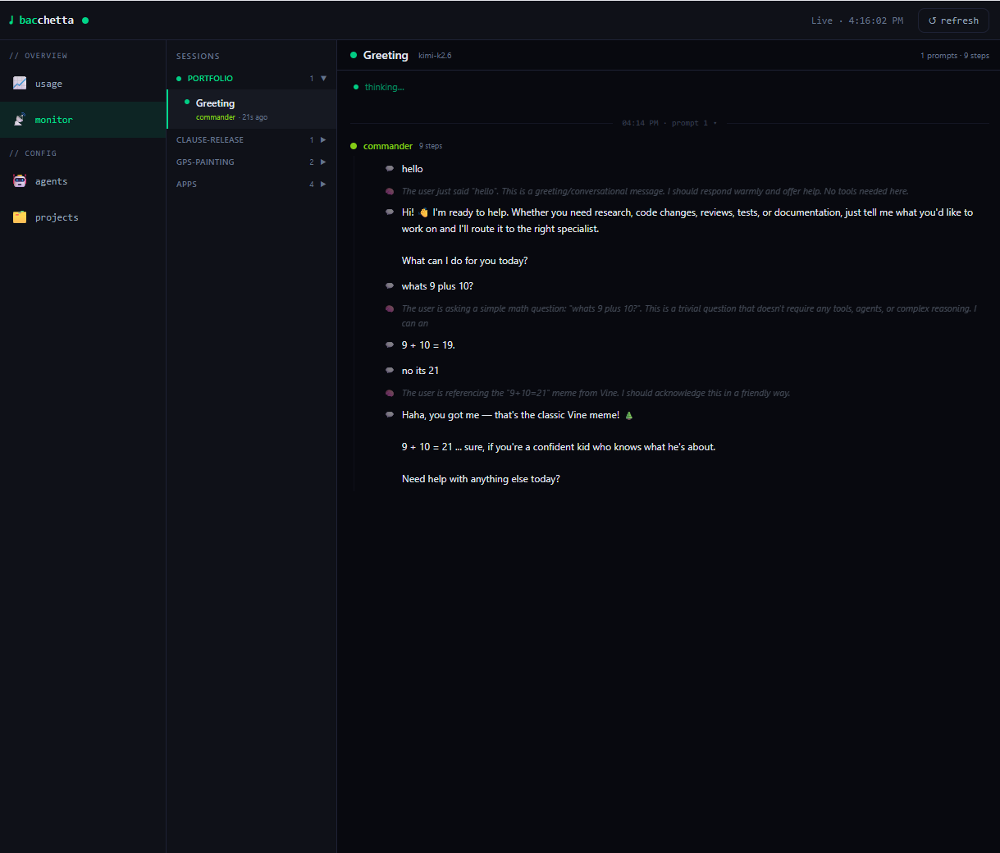
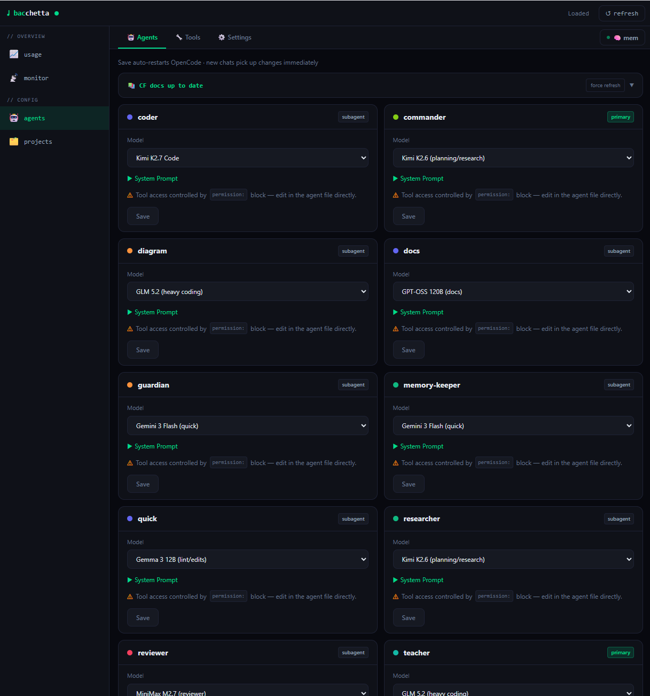
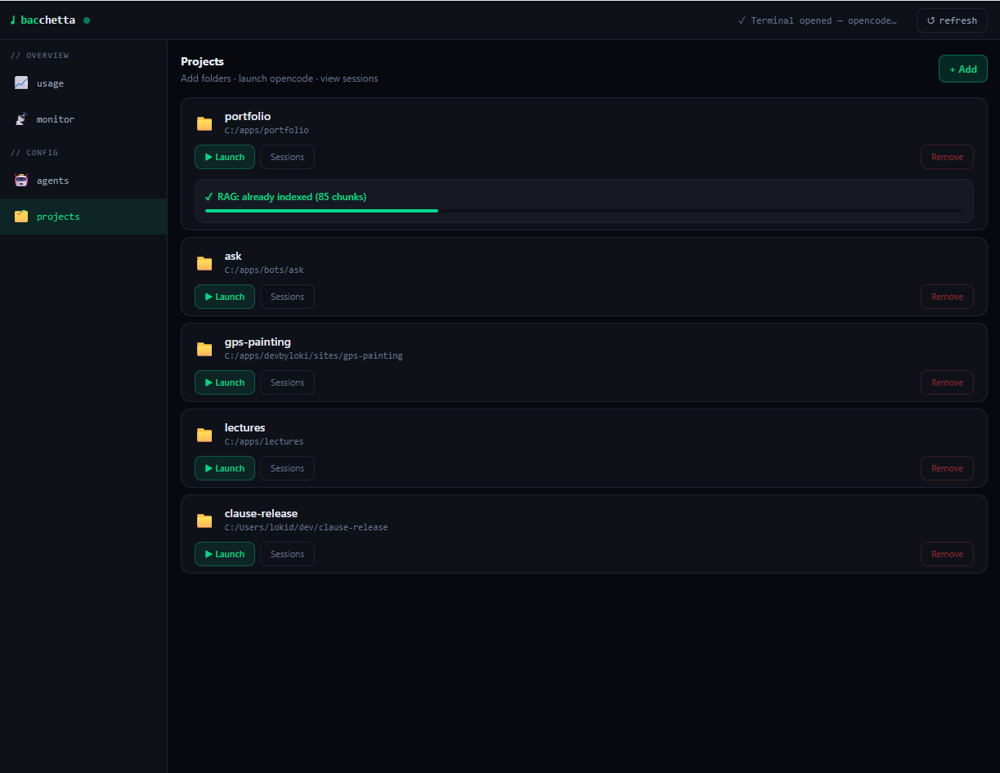
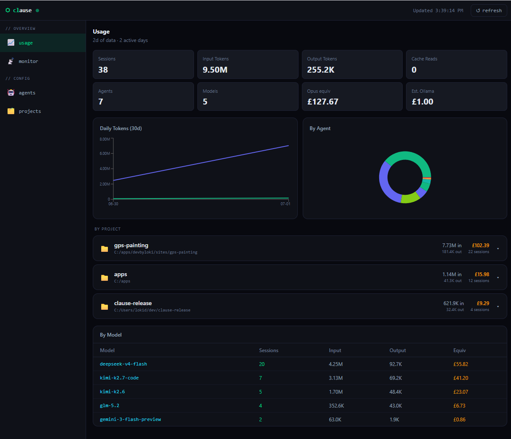
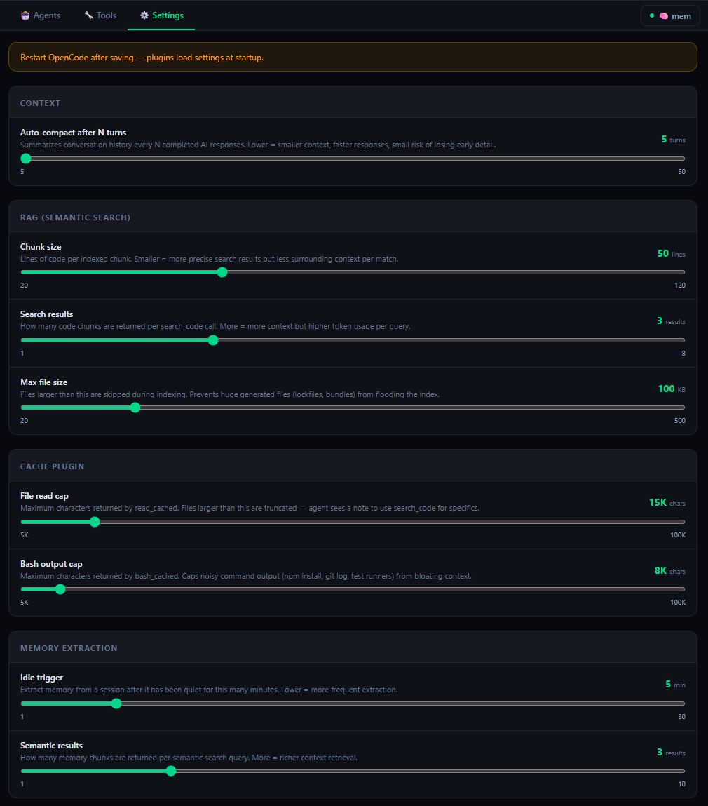
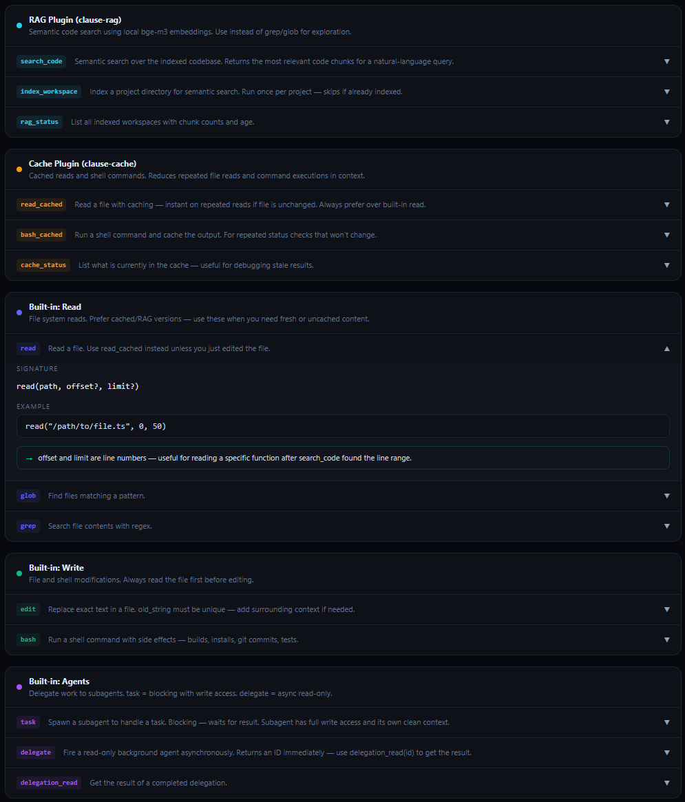
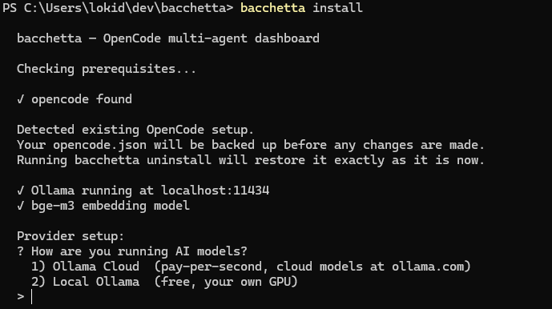

# Bacchetta

**Multi-agent AI coding dashboard for [OpenCode](https://opencode.ai)**

Bacchetta adds a real-time dashboard and an orchestrated agent pipeline on top of OpenCode. Instead of one model doing everything, a **commander** routes tasks to specialists — researcher, coder, reviewer, and more — with a **guardian** that strips secrets before anything touches the internet.

Works with **Ollama Cloud** (no GPU needed) and **local Ollama** (for high-end setups).

---

## Dashboard



*Monitor page — watch every agent step in real time, grouped by prompt*



*Agents page — view and edit every agent's system prompt and model*



*Projects page — manage multiple projects, start sessions, run RAG indexing*



*Usage page — token usage and cost across all sessions*



*Settings page — configure memory, models, and behaviour*

---

## What it does

- **Dashboard** at `localhost:6969` — monitor live agent activity, manage agents, view memory, switch projects
- **Commander agent** — orchestrates all work; routes to the right specialist, never builds without reviewing
- **9 specialist agents** — researcher, coder, quick, reviewer, guardian, memory-keeper, teacher, vision, diagram
- **Web search** — researcher uses SearXNG (self-hosted, started automatically via Docker) so searches stay private
- **Security layer** — guardian strips API keys, tokens, and credentials from briefs before they reach the internet

---

## Prerequisites

| Requirement | Install |
|-------------|---------|
| **Node.js 18+** | [nodejs.org](https://nodejs.org) |
| **OpenCode** | `npm install -g opencode-ai` |
| **Ollama** (local, for memory embeddings) | [ollama.com](https://ollama.com) |
| **Ollama Cloud account** *(recommended)* | [ollama.com](https://ollama.com) — pay per second, no GPU needed |
| **Docker Desktop** *(optional)* | [docker.com](https://www.docker.com/products/docker-desktop) — enables web search |

---

## Install

```bash
npm install -g bacchetta
bacchetta install
```

The installer walks you through everything:

1. Checks for OpenCode, Ollama, and Docker
2. Detects and backs up any existing OpenCode config
3. Asks whether you're using Ollama Cloud or local Ollama
4. Sets up agents, plugins, and memory

**Your existing OpenCode setup is safe.** Bacchetta backs up `opencode.json` before touching anything. `bacchetta uninstall` restores it exactly as it was.

### Ollama Cloud setup

Select option 1 during install. You'll be asked for your API key from [ollama.com/settings/keys](https://ollama.com/settings/keys).

The installer will print the exact command to save it as a permanent environment variable — no need to re-enter it each time.

### Local Ollama setup

Select option 2 during install. The installer shows hardware requirements and recommended models:

| VRAM / RAM | Recommended models |
|-----------|-------------------|
| 8 GB | `qwen2.5-coder:7b`, `gemma3:4b` |
| 16 GB | `qwen2.5-coder:14b` |
| 32 GB+ | `qwen2.5-coder:32b`, `llama3.3:70b` |

The installer prints the exact `ollama pull` commands for your chosen models.

---

## Start

```bash
bacchetta start
```

Dashboard opens at **http://localhost:6969**

Then use OpenCode either way:
- Run `opencode` in any project folder as usual
- Or open the dashboard → **Projects** → add a folder → **Start Session**

If you get a port conflict:

```bash
bacchetta restart
```

---

## How it works

Every task goes through a fixed pipeline:

```
You
  → commander
    ├─ (image in message?) → vision first
    ├─ guardian  ← strips secrets from the researcher brief
    ├─ researcher ← reads code, traces logic, searches the web
    ├─ YAGNI check (does this actually need to be built?)
    ├─ coder or quick ← writes the code
    ├─ reviewer ← 9-category audit, writes plan files if issues found
    └─ (issues found?) → fix loop → reviewer again
  → 2–3 line summary back to you
```

Commander has no file/bash tools itself — it can only delegate. This means it never skips the researcher, never skips the reviewer, and never puts your input directly into a web search.

---

## Agents

| Agent | What it does |
|-------|-------------|
| **commander** | Orchestrates everything — routes tasks, runs YAGNI checks, ensures reviewer always runs |
| **guardian** | Sanitizes briefs — strips API keys, tokens, and credentials before they reach internet-connected agents |
| **researcher** | Reads files, traces logic, searches the web via SearXNG |
| **coder** | Multi-file implementation, new features, refactors |
| **quick** | Single-file edits, config changes, small fixes |
| **reviewer** | 9-category audit after every build — writes plan files for anything critical |
| **memory-keeper** | Captures important context before it gets compressed out of the session |
| **teacher** | Explains concepts, fetches and searches documentation |
| **vision** | Interprets screenshots and images |
| **diagram** | Generates `.drawio` architecture diagrams, flowcharts, ERDs |



*Every agent's system prompt is visible and editable from the dashboard*

---

## The Guardian

When commander prepares a brief for researcher, it first passes it through `@guardian`. The guardian pattern-matches for:

- Stripe keys (`sk_live_*`, `sk_test_*`, `pk_live_*`)
- GitHub tokens (`ghp_*`, `ghs_*`)
- AWS access keys (`AKIA*`)
- Bearer tokens, JWTs, private keys
- `password=`, `secret=`, `token=` inline assignments
- Database connection strings with embedded credentials

Sensitive values are replaced with `[REDACTED: type]` before the brief reaches researcher. This prevents credentials from appearing in SearXNG queries or `webfetch` URLs, where they could end up in external search engine logs.

---

## Web search (SearXNG)



Bacchetta starts a SearXNG Docker container automatically on `bacchetta start`. SearXNG is a self-hosted meta-search engine — it queries Google, DuckDuckGo, Bing, GitHub, Stack Overflow, npm, and MDN, then returns results without tracking you.

**Requires Docker Desktop.**

On first start, Docker pulls the SearXNG image (~150MB, one-time). After that it starts in under a second. If you don't have Docker, everything else still works — the researcher just won't have web search.

---

## Uninstall

```bash
bacchetta uninstall
```

This will:
- Restore your original `opencode.json` from the backup taken at install time
- Remove all agent files that bacchetta created (files you modified are kept)
- Remove plugin files
- Print commands to remove npm packages if you want them fully gone

---

## Data locations

| What | Where |
|------|-------|
| Agent files | `~/.config/opencode/agents/` |
| Plugin files | `~/.config/opencode/plugin/` |
| Install manifest | `~/.config/opencode/bacchetta-manifest.json` |
| opencode.json backup | `~/.config/opencode/opencode.json.bacchetta.bak` |

---

## Pushing to GitHub

```bash
cd /path/to/bacchetta

git init
git add .
git commit -m "feat: initial release v1.0.1"

# Create a new repo at github.com, then:
git remote add origin https://github.com/YOUR_USERNAME/bacchetta.git
git branch -M main
git push -u origin main
```

---

## Publishing to npm

```bash
npm login
npm publish
```

---

## Works with

| Setup | Notes |
|-------|-------|
| **Ollama Cloud** | Recommended. Pay-per-second, no GPU needed. Sign up at [ollama.com](https://ollama.com) |
| **Local Ollama** | Free, runs on your machine. 16GB+ RAM/VRAM recommended |
| Any OpenCode provider | Swap models any time in `~/.config/opencode/opencode.json` |

---

## License

MIT
